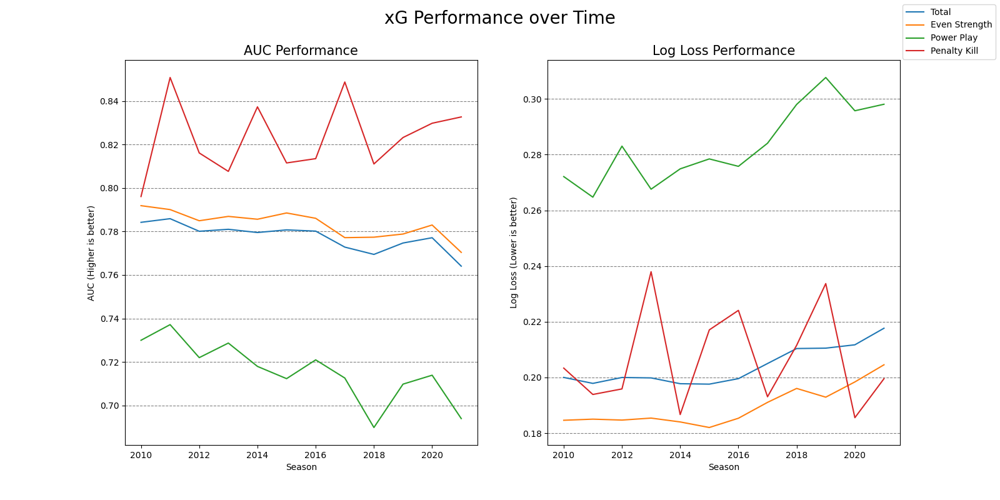

# NHL Expected Goals (xG) Model
## Overview
This is a Python repo that contains a machine learning model that uses data from the NHL API to determine the likelihood a given shot will result in a goal.

- **shotDataCreation.py** - this script uses the play-by-play data found in the raw data folder to create the model features listed below and store that in a CSV.
- **venueAdjustedShotDataCreation.py** - this script adjusts the x and y coordinates as well as the distance for each shot. The script uses the output CSV from shotDataCreation.py to do this. Shots are adjusted with two different methods one developed by Ken Krzywicki and one developed by Shucker and Curro. Shucker's and Curro's approach is implemented with a Python module called NHLArenaAdjuster, you can read more about it here: https://github.com/delara38/NHLArenaAdjuster. After shots are adjusted they are stored in a CSV.
- **xGModelCreation.py** - this script constructs a model using light gradient boosting and the shot data output by venueAdjustedShotDataCreation.py. This model then predicts the outcome of the shots between the years 2010-2021 and stores its predictions in a CSV.
- **benchmarkModel.py** - this script reads the CSV output by xGModelCreation.py and benchmarks the performance of the model using log loss and area under the curve (AUC).

## How it Works
### The Data
The model is built on data from the NHL's API, which is spatiotemporal data that records events that took place throughout games. This includes information about when the event took place, its location on the ice, and the teams/players that were involved in the play. I retrieved the data from the NHL API using a Python module named hockey scraper which was developed by Harry Shomer and you can read about it here: https://github.com/HarryShomer/Hockey-Scraper.

### Model Features
The following features are used in the model.

1) isStrongSide - an integer representing if a player is not shooting across their body.
2) x - the x coordinate reported by the NHL (standardized to the right side of the ice).
3) y - the y coordinate reported by the NHL (standardized to the right side of the ice).
4) Strength - skaters on the ice for minus skaters on the ice against.
5) GameTime - the number of seconds that have passed in the game.
6) PeriodTime - the number of seconds that have passed in the period.
7) Distance - the distance the shot was from the net.
8) Angle - the angle between the net and where the shot took place.
9) ShotType - an encoded integer that represents the shot type (wrist shot, slap shot, backhand, etc.).
10) GoalDiff - the goal differential relative to the shooting team.
11) LastEvent - an encoded integer that represents the last event that took place (penalty, hit, face-off, etc.).
12) LastEventDistance - the distance between the last event and the current shot.
13) LastEventZone - an integer that represents the zone the last event took place in relative to the shooting team (offensive, defensive, neutral).
14) LastEventAngle - the angle between the last event and the current shot.
15) LastEventSpeed - the speed between the last event and the current shot.
16) TimeSinceLastEvent - the number of seconds which have passed since the last event.
17) reboundAngDiff - if the shot was a rebound, what is the difference in angle from the first shot to the second shot. Value is NaN if the shot is not a rebound. 
18) reboundDistDiff - if the shot was a rebound, what is the difference in distance from the first shot to the second shot. Value is NaN if the shot is not a rebound. 
19) reboundSpeed - if the shot was a rebound, what is the speed from the first shot to the second shot. Value is NaN if the shot is not a rebound. 
20) fastbreakDist - if the shot was taken on a fastbreak, what is the distance between the last event and the current shot. Value is NaN is the shot was not taken on a fastbreak. 
21) fastbreakSpeed - if the shot was taken on a fastbreak, what is the speed between the last event and the current shot. Value is NaN is the shot was not taken on a fastbreak.
22) AdjX - the x coordinate adjusted using the method created by Shucker and Curro.
23) AdjY - the y coordinate adjusted using the method created by Shucker and Curro.
24) AdjDist - the distance adjusted using the method created by Shucker and Curro.
25) Xadj - the x coordinate adjusted using the method created by Ken Krzywicki.
26) Yadj - the y coordinate adjusted using the method created by Ken Krzywicki.
27) adj - the distance adjusted using the method created by Ken Krzywicki.
28) specialStrength - an encoded integer that represented less common team strengths (3v3, 6v4, etc.).

You can read about Ken Krzywicki's shot adjustment method here: http://hockeyanalytics.com/Research_files/SQ-RS0910-Krzywicki.pdf.

You can read about Shucker's and Curro's shot adjustment method here: https://www.sloansportsconference.com/research-papers/total-hockey-rating.

### Light Gradient Boosting
The model is built using Light Gradient Boosting a machine learning model developed and released by Microsoft in 2016. The documentation for the model can be found here: https://lightgbm.readthedocs.io/en/stable/.

### Hyperparameter Tuning
The Light Gradient Boosting model had its hyperparameters tuned with the use of Optuna's LightGBMTunerCV, which uses built-in LightGBM integration and Optuna's trial system to tune hyperparameters over cross-validation. In this case, I made use of 10-fold stratified cross-validation as the data is imbalanced (about 94% negative instances).

## Performance
### Overall Performance

#### 10-Fold Stratified Cross-Validation (2010-2020)
The table below shows the model performance over 10-fold stratified cross-validation for the seasons of 2010-2020.

|  Strength     |   AUC  |   Log Loss |
| ------------- | ------ | ---------- |
| All Strengths | 0.7788 |   0.2021   |
| Even Strength | 0.7848 |   0.1878   |
| Power Play    | 0.7184 |   0.2793   |
| Short Handed  | 0.8220 |   0.2064   |

#### Test Season (2021)
The table below shows the model performance for the left-out testing set which was all shots from the 2021 NHL season.

|  Strength     |   AUC  |   Log Loss |
| ------------- | ------ | ---------- |
| All Strengths | 0.7641 |   0.2177   |
| Even Strength | 0.7704 |   0.2046   |
| Power Play    | 0.6940 |   0.2981   |
| Short Handed  | 0.8326 |   0.1996   |

### Season-over-season Performance

The plot below shows how the performance of the model changes season over season. As is evident the model performs worse as time passes. This is likely due to strategical changes in the league, which have adopted a more expected goals-centric approach and now value shot quality (xG) more than quantity (CORSI). If you are interested in reading more about how analytics has changed over the years take a look at this article: https://ecp.ep.liu.se/index.php/linhac/article/view/479.

## Other Links
If you are interested in expected goals models and would like to see how others have constructed their models take a look at some of these resources.

- Evolving Hockey's xG Model - https://evolving-hockey.com/blog/a-new-expected-goals-model-for-predicting-goals-in-the-nhl/
- Hockey-Statistics xG Model - https://hockey-statistics.com/2022/08/14/building-an-xg-model-v-1-0/#:~:text=Expected%20goals%20is%20a%20way,information%20in%20my%20xG%20model
- Brain Macdonald's xG Model - http://hockeyanalytics.com/Research_files/NHL-Expected-Goals-Brian-Macdonald.pdf
- Alan Ryder's Original xG Paper - http://hockeyanalytics.com/Research_files/Shot_Quality.pdf
- MoneyPuck's xG Model - https://moneypuck.com/about.htm
- Harry Shomer's xG Model - https://github.com/HarryShomer/xG-Model
- Micah McCurdy's Magnus Model - https://hockeyviz.com/txt/xg7
